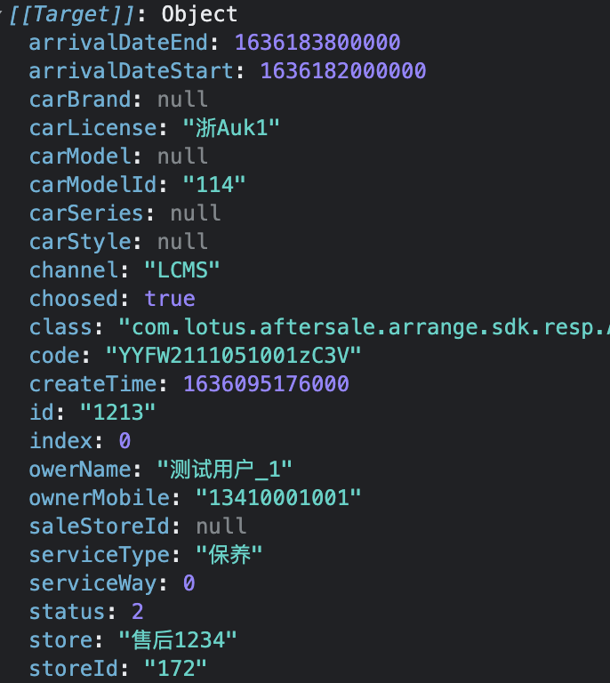

- [1.vscode插件  markdown in one使用](#1vscode插件--markdown-in-one使用)
  - [1.command+shift+p中的快捷命令：](#1commandshiftp中的快捷命令)
  - [2.常用快捷键](#2常用快捷键)
- [2.基础语法](#2基础语法)
## 1.vscode插件  markdown in one使用
### 1.command+shift+p中的快捷命令：
    Markdown All in One: Create Table of Contents 
    Markdown All in One: Update Table of Contents 
    Markdown All in One: Add/Update section numbers 
    Markdown All in One: Remove section numbers
    Markdown All in One: Toggle code span
    Markdown All in One: Toggle code block
    Markdown All in One: Print current document to HTML
    Markdown All in One: Print documents to HTML
    Markdown All in One: Toggle math environment
    Markdown All in One: Toggle list
### 2.常用快捷键
    Key    Command
    Ctrl + B    粗体
    Ctrl + I    斜体    Alt + S    删除线
    Ctrl + Shift + ]    标题(uplevel)
    Ctrl + Shift + [    标题(downlevel)
    Ctrl + M    Toggle math environment
    Alt + C    Check/Uncheck task list item
## 2.基础语法
# 一级标题（注意空格）
## 二级标题
> haha 
> heihei 
>>ddd

`buhuanhangbuhuanhangdekuaibuhuanhangdekuaibuhuanhangdekuaibuhuanhangdekuaibuhuanhangdekuaibuhuanhangdekuaidekuai`

